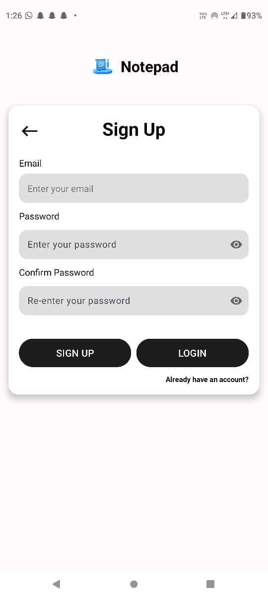

## Screenshots

### Home Page

### Profile Page

### Login Page

### Signup Page

**Notepad Android App**

A simple Android app that lets you keep and manage notes. Add, delete, and archive notes with a user profile page for managing personal data.

**Features**
Add Notes: Users can create and save personal notes.
Delete Notes: Notes can be deleted easily when no longer needed.
Archive Notes: Option to archive notes for future reference.
User Authentication: Secure login, signup, and password recovery functionality.
Profile Management: Users can manage their profiles.

**Technologies Used**
Language: Java
Database: Firebase (for authentication and real-time database)
UI: XML for layouts, custom UI components for login, signup, and profile pages
Libraries: Firebase Authentication, Glide (for image loading), and others

**Features Implemented**
Authentication
Login: Users can securely log in using their email and password.
Signup: Users can create a new account with an email and password.
Forgot Password: Allows users to reset their password via email.

**UI/UX**
Designed and implemented the user interface for:
Login Page
Signup Page
Forgot Password Page
Profile Page

**My Contribution**
Authentication: Implemented Firebase Authentication for user login, signup, and password reset.
UI: Designed the user interface for login, signup, and forgot password functionality, ensuring a smooth and user-friendly experience.
A simple Android app that lets you keep and manage notes. Add, delete, and archive notes with a user profile page for managing personal data.
